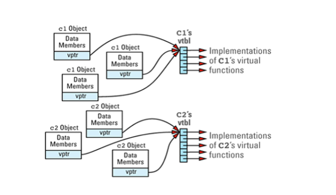
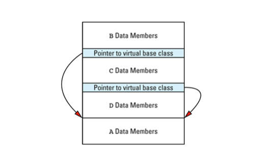
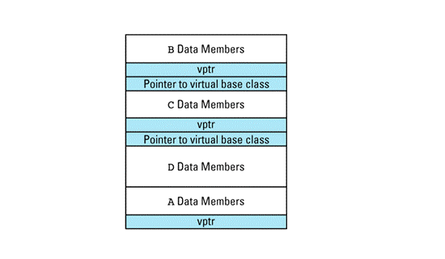
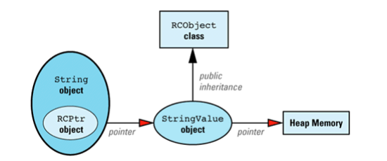
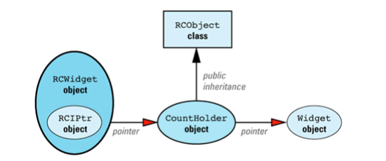
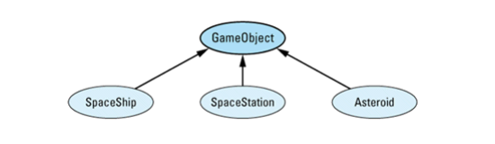
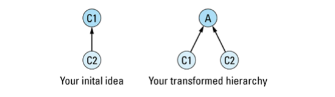

## 一. 基础议题
### 1. 指针与引用的区别
### 2. 尽量使用C++风格的类型转换
没有一个容易的方法来模拟dynamic_cast操作，你也可以回到C风格的类型转换方法上，但是这样的话你将不能获知类型转换是否失败。

使用新类型转换符的程序更容易被解析（不论是对人工还是对于工具程序），它们允许编译器检测出原来不能发现的错误。

### 3. 不要对数组使用多态
~~~cpp
class BST {...};
class BalancedBST: public BST {...};

void printBSTArray(ostream& s,
                    const BST array[],
                    int numElements)
{
    for (int i=0; i<numElements;) {
        s << array[i];
    }
}
~~~
当你传递给该函数一个含有BST对象的数组变量时，它能够正常运行:
~~~cpp
BST BSTArray[10];
...
printBSTArray(cout, BSTArray, 10); // 运行正常
~~~

然而，请考虑一下，当你把含有BalanceBST对象的数组变量传递给printBSTArray函数时，会产生什么样的后果：
~~~cpp
BalancedBST bBSTArray[10];
...
printBSTArray(cout, bBSTArray, 10); // 还会运行正常么？
~~~

array[i]只是一个指针算法的缩写：它所代码的是*(array)。array是一个指向数组起始地址的指针，但是array中各元素内存地址与数组的起始地址的间隔究竟有多大？它们的间隔是i * sizeof（一个在数组里的对象），因为在array数组[0]到[i]间有i个对象。 **编译器为了建立正确遍历数组的执行代码，它必须能够确定数组中对象的大小，这对编译器来说是很容易做到的**。参数array被声明为BST类型，所有array数组中的每一个元素都是BST类型，因此每个元素与数组起始地址的间隔是 i*sizeof(BST).

至少你的编译器是这么认为的。但是如果你把一个含有BalancedBST对象的数组变量传递给printBSTArray函数，你的编译器就会犯错误。

### 4. 避免无用的缺省构造函数
~~~cpp
class EquipmentPiece{
public:
    EquipmentPiece(int IDNumber);
    ...
};
~~~

EquipmentPiece类没有一个缺省构造函数，所有在三种情况下使用它，就会遇到问题。

- 第一种情况是建立数组时。

一般说来，没有一种办法能在建立对象数组时给构造函数传递参数。所有通常情况下，不可能建立EquipmentPiece对象数组：
~~~cpp
EquipmentPiece bestPieces[10]; // 错误！没有正确调用EquipmentPiece构造函数

EquipmentPiece *bestPieces = new EquipmentPiece[10]; // 错误！与上面的问题一样
~~~
有三种方法能回避开这个限制。对于使用非堆数组的一种解决方法是在数组定义时提供必要的参数：
~~~cpp
int ID1, ID2, ID3, ..., ID10;
...
EquipmentPiece bestPieces[] = {
    EquipmentPiece(ID1),
    EquipmentPiece(ID2),
    ...
    EquipmentPiece(ID10)
};
~~~
一个更通用的解决方法是利用指针数组来代替一个对象数组:
~~~cpp
typedef EquipmentPiece* PEP;

PEP bestPieces[10];
PEP *bestPieces = new PEP[10];

for(int i=0; i<10; i++)
    bestPieces[i] = new EquipmentPiece(ID Number);
~~~
不过这种方法有两个缺点，第一你必须删除数组里每个指针所指向的对象。如果你忘了，就会发生内存泄露。第二增加了内存分配量，因为正如你需要空间来容纳EquipmentPiece对象一样，你也需要空间来容纳指针。

如果你为数组分配raw memory，就可以避免浪费内存。使用placement new 方法在内存中构造EquipmentPiece对象：
~~~cpp
void *rawMemory = operator new);

EquipmentPiece *bestPieces = static_cast<EquipmentPiece *>(rawMemory);

for(int i=0; i<10; i++)
    new (&bestPieces[i]) EquipmentPiece(ID Number);
~~~

当你不想让它继续存在使用时，必须手动调用数组对象的析构函数，然后调用操作符delete[] 来释放raw memory:
~~~cpp
for(int i=9; i>=0; --i)
    bestPieces[i].~EquipmentPiece();
operator delete;
~~~

- 第二个问题是它们无法在许多基于模板的容器类里使用。

- 第三个问题是在设计虚拟类时所面临的要提供缺省构造函数还是不提供缺省构造函数的两难决策。不提供缺省构造函数的虚拟类，很难与其进行合作。因为几乎所有的派生类在实例化时都必须给虚基类构造函数提供参数。这就要求所有由没有缺省构造函数的虚基类继承下来的派生类都必须知道并理解提供给虚基类构造函数的参数的含义。

## 二. 运算符
### 5. 谨慎定义类型转换函数
有两种函数允许编译器进行隐式类型转换:**单参数构造函数**和**隐式类型转换运算符**。单参数构造函数是指只用一个参数既可以调用的构造函数。该函数可以是只定义了一个参数，也可以是虽定义了多个参数但第一个参数以后的所有参数都以缺省值。

单参数构造函数进行隐式类型转换更难消除。而且在很多情况下这些函数所导致的问题要甚于隐式类型转换运算符。
如下，一个array类模板：
~~~cpp
template<class T>
class Array{
public:
    Array(int lowBound, int highBound);
    Array(int size);
    T& operator;
    ...
};
~~~

例如比较Array<int>对象，部分代码如下：
~~~cpp
bool operator== (const Array<int>& lhs,
                const Array<int>& rhs)
{
    Array<int> a(10);
    Array<int> b(10);
    ...
    for(int i=0; i<10; i++){
        if (a == b[i]) {            // 啊！"a"应该是"a[i]"
            do something for when
            a[i] and b[i] are equal;
        } else {
            do something for when
            they're not;
        }
    }
}
~~~
当录入a时，我们偶然忘记了数组下标。我们希望编译器能报出各种各样的警告信息，但是它根本没有。**因为它把这个调用看成用Array<int>参数（对于a）和int（对于b[i]）参数调用operator== 函数**，然而没有operator== 函数是这样的参数类型，我们的编译器注意到它能通过调用Array<int>构造函数能转换int类型到Array<int>类型，这个构造函数只有一个int类型的参数。然后编译器如此去编译，生成的代码就象这样：
~~~cpp
for(int i=0; i<10; ++i)
    if (a == static_cast< Array<int> >(b[i]))
        ...
~~~
每一次循环都把a的内容与一个大小为b[i]的临时数组（内容是未定义的）比较。

为了解决单参数构造函数引起的隐式类型转换，使用explicit关键字。**构造函数用explicit声明，编译器会拒绝为了隐式类型转换而调用构造函数。**

让编译器进行隐式类型转换所造成的弊端要大于它所带来的好处，所以除非你确实需要，不要定义类型转换函数。

### 6. 自增、自减操作符前缀形式与后缀形式的区别
前缀形式返回一个引用，后缀形式返回一个const类型
### 7. 不要重载"&&","||",","
### 8. 理解各种不同含义的new和delete
函数operator new通常这样声明:
~~~cpp
void* operator new(size_t size);
~~~
返回值类型是void*, 因为这个函数返回一个未经处理的指针，未初始化的内存。你能增加额外的参数重载函数operator new,但是第一个参数类型必须是size_t。 **就像malloc一样， operator new的职责只是分配内存。它对构造函数一无所知**。

有时你有一些已经被分配但是尚未处理的内存，你需要在这些内存中构造一个对象。你可以使用一个特殊的operator new，它被称为**placement new**。
~~~cpp
// operator new
void* operator new(size_t, void *location)
{
    ...
    return location;
}

class Widget{
public:
    Widget(int widgetSize);
    ...
};

Widget * constructWidgetInBuffer(void* buffer, int widgetSize)
{
    return new(buffer) Widget(widgetSize);
}
~~~

## 三. 异常
为什么使用异常呢？自从C语言被发明初来，C程序员就满足于使用错误代码，所有为什么还要弄来异常呢，特别是如果异常如我上面所说的那样存在着问题。答案是简单的：**异常不能被忽略**。**如果一个函数通过设置一个状态变量或返回错误代码来表示一个异常状态，没有办法保证函数调用者将一定检测变量或测试错误代码**。结果程序会从它遇到的异常状态继续运行，异常没有被捕获，程序立即会终止执行。

### 9. 使用析构函数防止资源泄露
参考智能指针
### 10. 在构造函数中防止资源泄露
~~~cpp
BookEntry::BookEntry(const string& nme,
                    const string& address,
                    const string& imageFileName,
                    const string& audioClipFileName):
            theName(name)
            , theAddress(address)
            , theImage(0)
            , theAudioClip(0)
{
    try {
        if (imageFileName != "") {
            theImage = new Image(imageFileName);
        }
        if (audioClipFileName != "") {
            theAudioClip = new AudioClip(audioClipFileName);
        }
    }
    catch(...) {
        delete theImage;
        delete theAudioClip;
        throw;                  // 继续传递异常
    }
}
~~~

这似乎行了，但是它没有考虑下面这种情况.
~~~cpp
class BookEntry {
public:
    ...
private:
    ...
    Image* const theImage;          // 指针现在是const 类型
    AudioClip* const theAudioClip;
}
~~~
无论如何，在异常传递之前完成清除工作的唯一的方法就是捕获这些异常，所以如果我们不能在成员初始化表中放入try和catch语句，我们把它们移到其他地方。一种可能是在私有成员函数中，用这些函数返回指针指向初始化过的theImage和theAudioClip对象。
~~~cpp
class BookEntry {
public:
    ...
private:
    ...
    Image* initImage(const string& imageFileName);
    AudioClip* initAudioClip(const string& audioClipFileName);
};

BookEntry::BookEntry(const string& name,
                    const string& address,
                    const string& imageFileName,
                    const string& audioClipFileName):theName(name)
                    , theAddress(address)
                    , theImage(initImage(imageFileName))
                    , theAudioClip(initAudioClip(audioClipFileName))
                    {}
                    
// theImage首先被初始化，所以即使失败也不用担心资源泄露，这个函数不用进行异常处理
Image* BookEntry::initImage(const string& imageFileName)
{
    if (imageFileName != "") 
        return new Image(imageFileName);
    else
        return 0;
}

// theAudioClip被第二个初始化，如果theAudioClip初始化过程中抛出异常，
// 它必须确保theImage的资源被释放。
AudioClip* BookEntry::initAudioclip(const string& audioClipFileName)
{
    try {
        if(audioClipFileName != "") {
            return new AudioClip(audioClipFileName);
        } else {
            return 0;
        }
    }
    catch(...) {
        delete theImage;
        throw;
    }
}
~~~
上面的程序的确不错，也解决了令我们头疼不已的问题。不过也有缺点，在原则上应该属于构造函数的代码却分散在几个函数里，这令我们很难维护。

更好的解决方法是使用**智能指针**管理这些对象。
~~~cpp
class BookEntry {
public:
    ...
private:
    ...
    const std::trl::shared_ptr<Image> theImage;
    const std::trl::shared_ptr<AudioClip> theAudioClip;
};

BookEntry::BookEntry(const string& name,
                    const string& address,
                    const string& imageFileName,
                    const string& audioClipFileName):theName(name)
                    , theAddress(address)
                    , theImage(imageFileName != "" ? new Image(imageFileName) : 0)
                    , theAudioClip(audioClipFileName != "" ? new AudioClip(audioClipFileName) : 0)
                    {}

// 可以这样简化BookEntry的析构函数
BookEntry::~BookEntry()
{}
~~~
在这里，如果在初始化theAudioClip时抛出异常，theImage已经是一个被完全构造的对象，所以它能被智能指针自动删除掉。

### 11. 禁止异常信息传递到析构函数外

有两种情况下会调用析构函数。第一种是在正常情况下删除一个对象。第二种是异常传递的堆栈辗转开解过程中，由异常处理系统删除一个对象。

如果一个异常被激活的同时，析构函数也抛出异常，并导致程序控制权转移到析构函数外，C++将调用terminate函数。

不允许异常传递到析构函数外面还有第二个原因。如果一个异常被析构函数抛出而没有在函数内部捕获住，那么析构函数就不会完全运行（它会停在抛出异常的那个地方上）

### 12. 理解“抛出一个异常”与“传递一个参数”或“调用一个虚函数”间的差异

不论通过传值捕获异常还是通过引用捕获都将进行异常的拷贝操作。**C++规范要求被做为异常抛出的对象必须被复制**。

~~~cpp
catch(Widget& w)
{
    ...
    throw;              // 重新抛出异常，让它继续传递
}

catch(Widget& w) 
{
    ...
    throw w;            // 传递被捕获异常的拷贝
}
~~~
当第一个块中重新抛出的是当前异常，无论它是什么类型。特别是如果这个异常开始就是做为SpecialWidget类型抛出的, 那么第一个块中传递出去的还是SpecialWiget异常。重新抛出异常时没有进行拷贝操作。第二个catch块重新抛出的是新异常，类型总是Widget。**一般来说，你应该用throw来重新抛出当前的异常，因为这样不会改变被传递出去的异常类型，而且更有效率，因为不用生成一个新拷贝**。

### 13. 通过引用捕获异常
通过引用捕获异常可以避免对象切割的问题，而且异常对象只被拷贝一次。通过值捕获异常，会造成对象切割问题，异常对象被拷贝两次。

### 14. 审慎使用异常规格
编译器在编译时有时能够检测到异常规格的不一致。而且如果一个函数抛出一个不在异常规格范围里的异常，系统在运行时能够检测出这个错误，然后一个特殊的函数unexpected将被自动地调用。函数unexpected缺省的行为是调用函数terminate.对异常规格的触犯变成了一场并不应该发生的灾难。**在一个函数内调用其他没有异常规格的函数时应该去除这个函数的异常规格。**

虽然防止抛出unexpected异常时不现实的，但是C++允许你用其他不同的异常类型替换unexpected异常，例如你希望所有的unexpected异常都被替换为UnexpectedException对象。你能这样编写代码：
~~~cpp
class UnexpectedException {};

void convertUnexpected()
{
    throw UnexpectedException();
}

set_unexpected(convertUnexpected);
~~~

另一种把unexpected异常转变为知名类型的方式是让其重新抛出当前异常，这样异常将被替换为bad_exception。
~~~cpp
void convertUnexpected
{
    throw;
}

set_unexpected(convertUnexpected);
~~~

**异常规格还有一个缺点就是它们能导致unexpected被触发，即使一个high-level调用者准备处理被抛出的异常**，比如下面这个例子：
~~~cpp
class Session{
public:
    ~Session();
    ...
private:
    static void logDestruction(Session *objAddr) throw();
};

Session::~Session()
{
    try{
        logDestruction(this);
    }
    catch(...){}
}
~~~
假设被logDestruction调用的函数抛出了一个异常，而logDestruction没有捕获。当这个异常通过logDestruction传递出来，unexpected将被调用，缺省情况下将导致程序终止执行。但这是session析构函数的作者所希望的行为么？作者想处理所有可能的异常，所以好像不应该不给session析构函数里的catch块执行的机会就终止程序。如果logDestruction没有异常规格，这种事情就不会发生（一种防止的方法是如上所描述的那样替换unexpected）

### 15. 了解异常处理的系统开销

## 四. 效率
### 16. 牢记80-20准则
用profiler程序识别出令人讨厌的20%部分

### 17. 考虑使用懒惰计算法
从效率的观点来看，最佳的计算就是根本不计算。
#### 引用计数
#### 区别对待读取和写入
#### 懒惰提取

### 18. 分期摊还期望的计算
### 19. 理解临时对象的来源
在c++中正在的临时对象是看不见的，它们不出现在你的源代码中，建立一个没有命名的非堆对象会产生临时对象。**这种未命名的对象通常在两种条件下产生：为了使函数成功调用而进行隐式类型转换和函数返回对象时**。

首先考虑为使函数成功调用而建立临时对象这种情况。当传送给函数的对象类型与参数类型不匹配时会产生这种情况。

综上所述，临时对象是有开销的，所以你应该尽可能地去除它们，然而更重要的是训练自己寻找可能建立临时对象的地方。在任何时候只要见到常量引用参数，就存在建立临时对象而绑定在参数上的可能性。在任何时候只要见到函数返回对象，就会有一个临时对象被建立（以后被释放）。学会寻找这些对象构造，你就能显著地增强透过编译器表面动作而看到其背后开销的能力。

### 20. 协助完成返回值优化
以某种方法返回对象，能让编译器消除临时对象的开销，这样编写函数通常是很普通的。这种技巧是**返回constructor argument而不是直接返回对象**，你可以这样做：
~~~cpp
const Rational operator*(const Rational& lhs,
                        const Rational& rhs)
{
    return Rational(lhs.numerator() * rhs.numerator(),
                    lhs.denominator() * rhs.denominator());
}
~~~
C++规则允许编译器优化不出现的临时对象。因此如果你在如下的环境里调用operator*：
~~~cpp
Rational a = 10;
Rational b(1, 2);
Rational C = a * b;
~~~
编译器就会被允许消除在operator* 内的临时变量和operator*返回的临时变量。

### 21. 通过重载避免隐式类型转换
~~~cpp
class UPInt {
public:
    UPInt();
    UPInt(int value);
    ...
};

const UPInt operator+(const UPInt& lhs, const UPInt& rhs);

UPInt upi1, upi2;
...
UPInt upi3 = upi1 + upi2;
~~~
这里看不出什么令人惊讶的东西。现在考虑下面这些语句：
~~~cpp
upi3 = upi1 +10;
upi3 = 10 + upi2;
~~~
这些语句也能够成功允许。方法是通过建立临时对象把整形数10转换为UPInt。让编译器完成这种类型转换是很方便的，但是建立临时对象进行类型转换工作是有开销的，而我们不想承担这种开销。大多数C++程序员希望进行没有临时对象开销的隐式类型转换。但是在计算领域里发生不了赤子现象，我们如何能这么做呢？

隐式类型转换只是用来达到目的的手段，但是我们不要混淆手段与目的。还有一种方法可以成功进行operator+的混合类型调用，它将消除隐式类型转换的需要。通过声明如下几个函数达到这个目的。
~~~cpp
const UPInt operator+(const UPInt& lhs, const UPInt& rhs);
const UPInt operator+(const UPInt& lhs, int rhs);
const UPInt operator+(int lhs, const UPInt& rhs);
~~~

不过，必须谨记80-20规则，没有必要实现大量的重载函数，除非你有理由确信程序使用重载函数以后其整体效率会有显著的提高。

### 22. 考虑用运算符的赋值形式(op=)取代其单独形式(op)
### 23. 考虑变更程序库
### 24. 理解虚拟函数、多继承、虚基类和RTTI所需的代价

#### 虚拟函数
在程序中的每个类只要声明了虚函数或继承了虚函数，它就有自己的vtbl，并且类中的vtbl的项目是指向虚函数实现体的指针。

例如，如下这个类定义：
~~~cpp
class C1{
public:
    C1();
    virtual ~C1();
    virtual void f1();
    virtual int f2(char c) const;
    virtual void f3(const string& s);
    void f4() const;
    ...
};
~~~
C1的virtual table数组看起来如下图所示：

注意非虚函数f4不在表中，而且C1的构造函数也不在。非虚函数（包括构造函数，它也被定义为非虚函数）就象普通的C函数那样被实现，所以有关它们的使用在性能上没有特殊的考虑。

如果有一个C2类继承自C1，重新定义了它继承的一些虚函数，并加入了它自己的一些虚函数：
~~~cpp
class C2: public C1 {
public:
    C2();
    virtual ~C2();
    virtual void f1();
    virtual void f5(char *str);
    ...
};
~~~
它的virtual table项目指向与对象相适合的函数。这些项目包括指向没有被C2重定义的C1虚函数的指针：

这个论述引出了虚函数所需的第一个代价：你必须为每个包含虚函数的类的virtual table留出空间。类的vtbl的大小与类中声明的虚函数的数量成正比。每个类应该只有一个virtual table，所以virtual table所需的空间不会太大，但是如果你有大量的类或者在每个类中有大量的虚函数，你会发现vtbl会占用大量的地址空间。

采用启发式算法来决定哪一个object文件应该包含类的vtbl。通常启发式算法是这样的：要在一个object文件中生成一个类的vtbl，要求该object文件包含该类的第一个非内联、非纯虚拟函数定义（也就是类的实现体）。因此上述C1类的vtbl将被放置到包含C1::~ C1定义的object文件里（不是内联的函数），C2类的vtbl被放置到包含C1::~C2定义的object文件里（不是内联函数）。

假如我们有一个程序，包含几个C1和C2对象。对象、vptr和刚才我们讲述的vtbl之间的关系，在程序里我们可以这样去想象：

考虑这段程序代码：
~~~cpp
void makeACall(C1 *pC1)
{
    pC1->f1();
}
~~~
通过指针pC1调用虚拟函数f1。编译器生成的代码会做如下这些事情：
1. 通过对象的vptr找到类的vtbl。
2. 找到对应vtbl内的指向被调用函数的指针。
3. 调用第二步找到的指针所指向的函数。

如果我们假设每个对象有一个隐藏的数据叫做vptr，而且f1在vtbl中的索引为i，此语句
~~~cpp
pC1->f1();
~~~
生成的代码就是这样的
~~~cpp
(*pC1->vptr[i])(pC1);
~~~

#### 多继承、虚基类
多继承经常导致对虚基类的需求。没有虚基类，如果一个派生类有一个以上从基类的继承路径，基类的数据成员被复制到每一个继承类对象里，继承类与基类间的每条路径都有一个拷贝。程序员一般不会希望发生这种复制，而把基类定义为虚基类则可以消除这种复制。然而虚基类本身会引起它们自己的代价，因为虚基类的实现经常使用指向虚基类的指针做为避免复制的手段，一个或者更多的指针被存储在对象里。

例如考虑下面这幅图，我经常称它为“恐怖的多继承菱形”

这里A是一个虚基类，因为B和C虚拟继承了它。D对象会产生这样布局：

把基类的数据成员放在对象的最底端，这显得有些奇怪，但是它经常这么做。

如果我们把这幅图与前面展示如何把virtual table pointer加入到对象里的图片合并起来，我们就会认识到如果在上述继承体系里的基类A有任何虚函数，对象D的内存布局就是这样的：

#### 运行时类型识别RTTI
运行时类型识别RTTI能让我们在运行时找到对象和类的有关信息，所以肯定有某个地方存储了这些信息让我们查询。这些信息被存储在类型为type_info的对象里，你能通过使用typeid操作符访问一个类的type_info对象。

语言规范上这样描述：我们保证可以获得一个对象动态类型信息，如果该类型有至少一个虚函数。RTTI被设计为在类的vtbl基础上实现。

例如，vtbl数组的索引0处可以包含一个type_info对象的指针，这个对象属于该vtbl相对应的类。上述C1类的vtbl看上去像这样：

## 五. 技巧

### 25. 将构造函数和非成员函数虚拟化
~~~cpp
class NLComponent {
public:
    virtual NLComponent* clone() const = 0;
    ...
};

class TextBlock: public NLComponent {
public:
    virtual TextBlock* clone() const    // virtual copy constructor
    { return new TextBlock(*this);}
    ...
};

class Graphic: public NLComponent{
public:
    virtual Graphic* clone() const     // virtual copy constructor
    { return new Graphic(*this);}
    ...
};
~~~

注意上述代码的实现利用了最近才被采纳的较宽松的虚拟函数返回值类型规则。被派生类重定义的虚拟函数不用必须与基类的虚拟函数具有一样的返回类型。

具有虚拟行为的非成员函数很简单。你编写一个虚拟函数来完成工作，然后再写一个非虚拟函数，它什么也不做只是调用这个虚拟函数。

### 26. 限制某个类所能产生的对象数量
#### 内联与函数内静态对象的关系
~~~cpp
Printer& thePrinter()
{
    static Printer p;
    return p;
}
~~~
除了第一次执行这个函数时（也就是构造p时），其它时候这就是一个一行函数------它由"return p;"一条语句组成。这个函数最适合做为内联函数使用。然而它不能被声明为内联。从概念上讲，内联意外着编译器用函数体替代对该函数的每一个调用，不过非成员函数还不只这些。非成员函数还有其它的含义。它还意外着内部链接internal linkage。

**带有内部链接的函数可能在程序内被复制，这种复制也包括函数内的静态对象**。如果建立一个包含局部静态对象的非成员函数，你可能会使程序的静态对象的拷贝超过一个！所以不要建立包含局部静态数据的非成员函数。

#### 一个具有对象计数功能的基类
~~~cpp
template<class BeingCounted>
class Counted {
public:
    class TooManyObjects{};         // 用来抛出异常
    static int objectCount() { return numObjects;}
protected:
    Counted();
    Counted(const Counted& rhs);    
                                    
    ~Counted() { --numObjects;}
private:
    static int numObjects;
    static const size_t maxObjects;
    void init();
};

template<class BeingCounted>
Counted<BeingCounted>::Counted()
{init();}

template<class BeingCounted>
Counted<BeingCounted>::Counted(const Counted<BeingCounted>&)
{init();}

template<class BeingCounted>
void Counted<BeingCounted>::init()
{
    if (numObjects >= maxObjects)
        throw TooManyObjects();
    ++numObjects;
}
~~~
现在我们能修改Printer类，这样使用Counted模板：
~~~cpp
class Printer: private Counted<Printer> {
public:
    static Printer * makePrinter();
    static Printer * makePrinter(const Printer& rhs);
    ~Printer();
    ...
    using Counted<Printer>::objectCount;
    using Counted<Printer>::TooManyObjects;
private:
    Printer();                      // 我们不定义这个函数
    Printer(const Printer& rhs);    // 因为不允许进行拷贝
}
~~~
Printer使用了Counter模板来跟踪存在多少Printer对象，坦率地说，除了Printer的编写者，没有人关心这个事实。它的实现细节最好是private，这就是为什么使用private继承的原因。另一种方法是在Printer和 Counted<Printer>之间使用public继承，但是我们必须给Counted类一个虚拟析构函数。在Counted中存在虚函数，几乎肯定影响从Counted继承下来的对象的大小和布局。

因为我们使用private继承，这个函数在Printer类中成为了private。为了恢复该函数的public访问权，我们使用using声明；

最后还有一点需要注意，必须定义Counted内的静态成员。对于numObjects来说，这很容易------我们只需要在Counted的实现文件里定义它即可：
~~~cpp
template<class BeingCounted>
int Counted<BeingCounted>::numObjects;  // 自动初始化为0
~~~

对于maxObjects，我们不对maxObject进行初始化。而是让此类的客户端提供合适的初始化。Printer的作者必须把这条语句加入到一个实现文件里：
~~~cpp
const size_t Counted<Printer>::maxObjects = 10;
~~~

### 27. 要求或禁止在堆中产生对象
#### 要求在堆中建立对象
非堆对象在定义它的地方被自动构造，在生存时间结束时自动被释放，所以只要禁止使用隐式的构造函数和析构函数，就可以实现这种限制。
~~~cpp
class UPNumber {
public:
    UPNumber();
    void destory() const {delete this;}
    ...
private:
    ~UPNumber();
};

UPNumber n;                 // 错误！（在这里合法，但是当它的析构函数被隐式地调用时，就不合法了）
UPNumber *p = new UPNumber; // 正确
...
delete p;                   // 错误！
p->destroy();               // 正确
~~~

#### 判断一个对象是否在堆中
~~~cpp
class HeapTracked {
public:
    class MissingAddress{};
    virtual ~HeapTracked() = 0;
    static void* operator new(size_t size);
    static void operator delete(void *ptr);
    bool isOnHeap() const;
private:
    typedef const void* RawAddress;
    static list<RawAddress> addresses;
};
~~~
以下是HeapTracked的全部实现：
~~~cpp
list<RawAddress> HeapTracked::addresses;

HeapTracked::~HeapTracked() {}

void* HeapTracked::operator new(size_t size)
{
    void *memPtr = ::operator new(size);
    addresses.push_front(memPtr);
    return memPtr;
}

void HeapTracked::operator delete(void *ptr)
{
    list<RawAddress>::iterator it = find(addresses.begin(), addresses.end(), ptr);
    if (it != addresses.end()) {
        addresses.erase(it);
        ::operator delete(ptr);
    } else {
        throw MissingAddress();
    }
}

bool HeapTracked::isOnHeap() const
{
    // 得到一个指针，指向*this占据的内存空间的起始处
    const void *rawAddress = dynamic_cast<const void*>(this);
    list<RawAddress>::iterator it = find(addresses.begin(), addresses.end(), rawAddress);
    return it != addresses.end();
}
~~~

只有一个地方可能让你感到困惑，就是这个语句
~~~cpp
const void *rawAddress = dynamic_cast<const void*>(this);
~~~
多继承或虚基类的对象会有几个地址，但是因为isOnHeap仅仅用于HeapTracked对象中，我们能使用dynamic_cast的一种特殊的特效来消除这个问题。只需简单地放入dynamic_cast,把一个指针dynamic_cast成void*类型，生成的指针将指向“原指针指向对象内存”的开始处。但是dynamic_cast只能用于“指向至少具有一个虚拟函数的对象”的指针上。

使用这个类，即使是最初级的程序员也可以在类中加入跟踪堆中指针的功能。例如我们想判断Assert对象指针指向的是否是堆对象：
~~~cpp
class Asset: public HeapTracked {
    ...
};
~~~
#### 禁止堆对象
可以把operator new声明为private，如果你不想让用户在堆中建立UPNumber对象，你可以这样编写：
~~~cpp
class UPNumber {
private:
    static void* operator new(size_t size);
    static void operator delete(void *ptr);
    ...
};
~~~

### 28. 灵巧指针
使用灵巧指针代替C++的内键指针，你就能控制下面这些方面的指针的行为：
​    
1. 构造和析构
2. 拷贝和赋值
3. Dereferencing(取出指针所指东西的内容)

~~~cpp
class SmartPtr {
public:
    SmartPtr(T* realPtr = 0);
    SmartPtr(const SmartPtr& rhs);
    ~SmartPtr();
    SmartPtr& operator=(const SmartPtr& rhs);
    T* operator->() const;
    T& operator*() const;
private:
    T *pointee;
}
~~~

### 29. 引用计数

~~~cpp
template<class T>
class RCPtr {
public:
    RCPtr(T* realPtr = 0);
    RCPtr(const RCPtr& rhs);
    ~RCPtr();
    RCPtr& operator=(const RCPtr& rhs);
    T* operator->() const;
    T& operator*() const;
private:
    T *pointee;
    void init();
};

class RCObject {
public:
    void addReference();
    void removeReference();
    void markUnshareable();
    bool isShareable() const;
    bool isShared() const;
protected:
    RCObject();
    RCObject(const RCObject& rhs);
    RCObject& operator=(const RCObject& rhs);
    virtual ~RCObject() = 0;
private:
    int refCount;
    bool shareable;
};

class String {
public:
    String(const char* value="");
    const char& operator const;
    char& operator;
private:
    struct StringValue: public RCObject {
        char *data;
        StringValue(const char* initValue);
        StringValue(const StringValue& rhs);
        void init(const char* initValue);
        ~StringValue();
    };
    RCPtr<StringValue> value;
};
~~~

RCObject实现
~~~cpp
RCObject::RCObject():refCount(0)
, shareable(true)
{}

RCObject::RCObject(const RCObject&):refCount(0)
, shareable(true)
{}

RCObject& RCObject::operator=(const RCObject&)
{
    return *this;
}

RCObject::~RCObject()
{}

void RCObject::addReference()
{
    ++refCount;
}

void RCObject::removeReference()
{
    if(--feCount == 0)
        delete this;
}

void RCObject::markUnshareable()
{
    shareable = false;
}

bool RCObject::isShareable() const
{
    return shareable;
}

bool RCObject::isShared() const
{
    return refCount > 1;
}
~~~
RCPtr实现
~~~cpp
template<class T>
void RCPtr<T>::init()
{
    if (pointee == 0)
        return;
    if (pointee->isShareable() == false) {
        pointee = new T(*pointee);
    }
    pointee->addReference();
}

template<class T>
RCPtr<T>::RCPtr(T* realPtr):pointee(realPtr)
{
    init();
}

template<class T>
RCPtr<T>::RCPtr(const RCPtr& rhs):pointee(rhs.pointee)
{
    init();
}

template<class T>
RCPtr<T>::~RCPtr()
{
    if(pointee)
        pointee->removeReference();
}

template<class T>
RCPtr<T>& RCPtr<T>::operator=(const RCPtr& rhs)
{
    if (pointee != rhs.pointee) {
        if (pointee)
            pointee->removeReferenve();
        pointee = rhs.pointee;
        init();
    }
    return *this;
}

template<class T>
T* RCPtr<T>::operator->() const
{
    return pointee;
}

template<class T>
T& RCPtr<T>::operator*() const
{
    return *pointee;
}
~~~

StringValue的实现
~~~cpp
void String::StringValue::init(const char* initValue)
{
    data = new char[strlen(initValue) + 1];
    strcpy(data, initValue);
}

String::StringValue::StringValue(const char* initValue)
{
    init(initValue);
}

String::StringValue::StringValue(const StringValue& rhs)
{
    init(rhs.data);
}

String::StringValue::~StringValue()
{
    delete [] data;
}
~~~

String 的实现
~~~cpp
String::String(const char* initValue):value(new StringValue(initValue))
{}

const char& String::operator[] (int index) const
{
    return value->data[index];
}

char& String::operator
{
    if (value->isShared()) {
        value = new StringValue(value->data);
    }
    value->markUnshareable();
    return value->data[index];
}
~~~

到现在为止，我们所讨论的都假设我们能够访问有关类的源码。但如果我们想让一个位于支撑库中而无法修改的类获得引用计算的好处呢？不可能让它们从RCObject继承的，所有也不能对它们使用灵巧指针RCPtr。

我们现在可以应用这句格言：**计算机科学中的绝大部分问题都可以通过增加一个中间层次来解决。** 我们增加一个新类CountHolder以处理引用计数，它从RCObject继承。我们让CountHolder包含一个指针指向Widget。然后用等价的灵巧指针RCIPtr模板替代RCPtr模板，它知道CountHolder类的存在。

### 30. 代理类
~~~cpp
template<class T>
class Array2D{
public:
    class Array1D {
    public:
        T& operator;
        const T& operator const;
        ...
    };
    Array2D(int dim1, int dim2);
    Array1D operator;
    const Array1D operator const;
    ...
};
~~~
现在，它合法了：
~~~cpp
Array2D<float> data(10, 20);
...
cout << data[3][6];
~~~

这里是一个被带引用计数的string类用作proxy类以区分operator[]是作左值还是右值使用的例子：
~~~cpp
class String{
public:
    class CharProxy {
    public:
        CharProxy(String& str, int index);
        CharProxy& operator=(const CharProxy& rhs);
        CharProxy& operator=(char c);
        operator char() const;
    private:
        String& theString;
        int charIndex;
    };
    const CharProxy operator const;
    CharProxy operator;
    ...
    friend class CharProxy;
    private:
        RCPtr<StringValue> value;
};
~~~

Proxy类可以完成一些其他方法很难甚至不可能实现的行为。多维数组是一个例子，左值/右值的区分是第二个，限制隐式类型转换是第三个。

同时，proxy类也有缺点。作为函数返回值，proxy对象是临时对象，它们必须被构造和析构。Proxy对象的存在增加了软件的复杂度，因为额外增加的类使得事情更难设计、实现、理解和维护。

### 31. 让函数根据一个以上的对象来决定怎么虚拟
在你构造的世界中的宇宙飞船、太空站和小行星，它们可能会互相碰撞。假设其规则是:

- 如果飞船和空间站以低速接触，飞船将泊入空间站。否则，它们将有正比于相对速度的损坏。
- 如果飞船与飞船，或空间站与空间站相互碰撞，参与者均有正比于相对速度的损坏。
- 如果小行星与飞船或空间站碰撞，小行星毁灭。如果是小行星体积较大，飞船或空间站也毁坏。
- 如果两个小行星碰撞，将碎裂为更小的小行星，并向各个方向溅射。

~~~cpp
class GameObject {...};
class SpaceShip: public GameObject {...};
class SpaceStation: public GameObject {...};
class Asteroid: public GameObject {...};
~~~
现在，假设你开始进入程序内部，写代码来检测和处理物体间的碰撞。你会提出这样一个函数：
~~~cpp
void checkForCollision(GameObject& object1,
                    GameObject& object2)
{
    if (theyJustCollided(object1, object2)) {
        processCollision(object1, object2);
    } else {
        ...
    }
}
~~~
发生的结果将取决于object1和object2的真实类型，但你并不知道其真实类型；如果碰撞的处理过程只取决于object1的动态类型，你可以将processCollision设为虚函数，并调用object1.processCollision(object2)。如果只取决于object2的动态类型，也可以同样处理。但现在，取决于两个对象的动态类型。虚函数体系只能作用在一个对象身上，它不足以解决问题。

你需要的是一种作用在多个对象上的虚函数。C++ 没有提供这样的函数。C++ 没有直接提供多重调度（multiple dispatch）。

#### 模拟虚函数表
编译器通常创建一个函数指针数组来实现虚函数，并在虚函数被调用时在这个数组中进行下标索引。**使用vtbl, 编译器避免了使用if...then...else链**，并能在所有调用虚函数的地方生成同样的代码：确定正确的vtbl下标，然后调用vtbl这个位置上存储的指针所指向的函数。

~~~cpp
class GameObject {
public:
    virtual void collide(GameObject& otherObject) = 0;
    ...
};

class SpaceShip: public GameObject {
public:
    virtual void collide(GameObject& otherObject) = 0;
    
    virtual void hitSpaceShip(GameObject& spaceShip);
    virtual void hitSpaceStation(GameObject& spaceShip);
    virtual void hitAsteroid(GameObject& spaceShip);
    
private:
    typedef void (SpaceShip::*HitFunctionPtr)(GameObject&);
    typedef map<string, HitFunctionPtr> HitMap;
    
    static HitFunctionPtr lookup(const GameObject& whatWeHit);
    static HitMap* initializeCollisionMap();
    ...
};

SpaceShip::HitMap* SpaceShip::initializeCollisionMap()
{
    HitMap *phm = new HitMap;
    (*phm)["SpaceShip"] = &hitSpaceShip;
    (*phm)["SpaceStation"] = &hitSpaceStation;
    (*phm)["Asteroid"] = &hitAsteroid;
    return phm;
}

SpaceShip::HitFunctionPtr
SpaceShip::lookup(const GameObject& whatWeHit)
{
    static auto_ptr<HitMap> collisionMap(initializeCollisionMap);
    
    HitMap::iterator mapEntry = collisionMap.find(typeid(whatWeHit).name());
    if (mapEntry == collisionMap.end()) return 0;
    return (*mapEntry).sencond;
}

void SpaceShip::collide(GameObject& otherObject)
{
    HitFunctionPtr hfp = lookup(otherObject);
    if (hfp) {
        (this->*hfp)(otherObject);
    } else {
        thow CollisionWithUnknownObject(otherObject);
    }
}

void SpaceShip::hitSpaceShip(GameObject& spaceShip)
{
    SpaceShip& otherShip = dynamic_cast<SpaceShip&>(spaceShip);
    // process a SpaceShip-SpaceShip collision
}

void SpaceShip::hitSpaceStation(GameObject& spaceStation)
{
    SpaceStation& station = dynamic_cast<SpaceStation&>(spaceStation);
    // process a SpaceShip-SpaceStation collision
}

void SpaceShip::hitAsteroid(GameObject& asteroid)
{
    Asteroid& otherAsteroid = dynamic_cast<Asteroid&>(asteroid);
    // process a SpaceShip-Asteroid collision
}
~~~

#### 使用非成员的碰撞处理函数
~~~cpp
#include "SpaceShip.h"
#include "SpaceStation.h"
#include "Asteroid.h"

namesapce {             // unnamed namespace
    void shipAsteroid(GameObject& spaceShip, GameObject& asteroid);
    void shipStation(GameObject& spaceShip, GameObject& spaceStation);
    void asteroidStation(GameObject& asteroid, GameObject& spaceStation);
    
    void asteroidShip(GameObject& asteroid, GameObject& spaceShip)
    { shipAsteroid(spaceShip, asteroid);}
    
    void stationShip(GameObject& spaceStation, GameObject& spaceShip)
    { shipStation(spaceShip, spaceStation);}
    
    void stationAsteroid(GameObject& spaceStation, GameObject& asteroid)
    { asteroidStation(asteroid, spaceStation);}
    
    ...
    
    typedef map< pair<string, string>, HitFunctionPtr > HitMap;
    
    pair<string, string> makeStringPair(const char *s1, const char *s2);
    HitMap* initializeCollisionMap();
    HitFunctionPtr lookup(const string& class1, const string& class2);
}

void processCollision(GameObject& object1, GameObject& object2)
{
    HitFunctionPtr phf = lookup(typeid(object1).name(), typeid(object2).name());
    if (phf)
        phf(object1, object2);
    else 
        throw UnknownCollision(object1, object2);
}
~~~
注意，用了无名的命名空间来包含实现碰撞处理函数所需要的函数。无名命名空间中的东西是当前编译单元（其实就是当前文件）私有的------很像被申明为文件范围内static的函数一样。**有了命名空间后，文件范围内的static已经不赞成使用了**。

~~~cpp
namespace {
    pair<string, string> makeStringPair(const char *s1, const char *s2)
    {
        return pair<string, string>(s1, s2);
    }
}

namespace {
    HitMap * initializeCollisionMap()
    {
        HitMap *phm = new HitMap;
        (*phm)[makeStringPair("SpaceShip", "Asteroid")] = &shipAsteroid;
        (*phm)[makeStringPair("SpaceShip", "SpaceStation")] = &shipStation;
        ...
        return phm;
    }
}

namespace {
    HitFunctionPtr lookup(const string& class1, const string& class2)
    {
        static auto_ptr<HitMap> collisionMap(initializeCollisionMap());
        
        HitMap::iterator mapEntry = collisionMap->find(make_pair(class1, class2));
        if (mapEntry == collisionMap->end())
            return 0;
        return (*mapEntry).second;
    }
}
~~~

#### 初始化模拟虚函数表（再次讨论）
按目前情况来看，我们的设计完全是静态的。每次我们注册一个碰撞处理函数，我们就不得不永远留着它。如果我们想在游戏运行过程中增加、删除或修改碰撞处理函数，该怎么办？
~~~cpp
class CollisionMap {
public:
    typedef void (*HitFunctionPtr)(GameObject&, GameObject&);
    void addEntry(const string& type1
                , const string& type2
                , HitFunctionPtr collisionFunction
                , bool symmetric = true);
    void removeEntry(const string& type1
                    , const string& type2);
    
    static CollisionMap& theCollisionMap();
    
private:
    CollisionMap();
    CollisionMap(const CollisionMap&);
};
~~~
借助于CollisionMap类，每个想增加映射关系的用户可以直接这么做：
~~~cpp
void shipAsteroid(GameObject& spaceShip, GameObject& asteroid);
CollisionMap::theCollisionMap().addEntry("SpaceShip", "Asteroid", &shipAsteroid);

void shipStation(GameObject& spaceShip, GameObject& spaceStation);
CollisionMap::theCollisionMap().addEntry("SpaceShip", "SpaceStation", &shipStation);

void asteroidStation(GameObject& asteroid, GameObject& spaceStation);
CollisionMap::theCollisionMap().addEntry("Asteroid", "SpaceStation", &asteroidStation);
~~~

必须确保在发生碰撞前就将映射关系加入映射表。一个方法是让GameObject的子类在构造函数中进行确认。这将导致在运行期的一个小小的性能开销。另外一个方法是创建一个RegisterCollisionFunction类：
~~~cpp
class RegisterCollisionFunction {
public:
    RegisterCollisionFunction(const string& type1
                            , const string& type2
                            , CollisionMap::HitFunctionPtr collisionFunction
                            , bool symmetric = true)
    {
        CollisionMap::theCollisionMap().addEntry(type1, type2, collisionFunction, symmetric);
    }
}
~~~
用户可以使用此类型的一个全局对象来自动地注册他们所需要的函数：
~~~cpp
RegisterCollisionFunction cf1("SpaceShip", "Asteroid", &shipAsteroid);
RegisterCollisionFunction cf2("SpaceShip", "SpaceStation", &shipStation);
RegisterCollisionFunction cf3("Asteroid", "SpaceStation", &asteroidStation);

...

int main(int argc, char * argv)
{
    ...
}
~~~
因为这些全局对象在main被调用前就构造了，它们在构造函数中注册的函数也在main被调用前就加入映射表了。

## 六. 杂项

### 32. 在未来时态下开发程序
用C++ 语言自己来表达设计上的约束条件，而不是用注释或文档。例如，如果一个类被设计得不会被继承，不要只是在其头文件中加个注释，用C++的方法来阻止继承；

处理每个类的赋值和拷贝构造函数，即使“从没人这样做过”.他们现在没有这么做并不意味着他们以后不这么做。

要承认：只要是能被人做的，就有人这么做。他们会抛异常；会用自己给自己赋值；在没有赋初值前就使用对象；给对象赋了值而没有使用；会赋过大的值、过小的值或空值。一般而言，只要能编译通过，就有人会这么做。所有，要使得自己的类易于被正确使用而难以误用。

将你的代码设计得当需要变化时，影响是局部的。尽可能地封装；将实现细节声明为私有。只要可能，使用无名的命名空间和文件内的静态对象或函数。避免导致虚基类的设计，因为这种类需要每个派生类都直接初始化它------即使是那些间接派生类。避免需要RTTI的设计，它需要if...then...else型的瀑布结构。

### 33. 将非尾端类设计为抽象类
如果你有两个实体类C1和C2并且你喜欢C2公有继承自C1，你应该将两个类的继承层次改为三个类的继承层次，通过创造一个新的抽象类A并将C1和C2都从它继承：

这种修改的重要价值是强迫你确定抽象类A。很清楚，C1和C2有共性；这就是为什么它们用公有继承联系在一起的原因。修改后，你必须确定这些共性到底是什么。而且，你必须用c++的类将这些共性组织起来，它将不再是模糊不清的东西了，它到达了一个抽象类型的层次，有明确定义的成员函数和明确定义的语义。

这一切导致了一些令人不安的思考。毕竟，每个类都完成了某些类型的抽象，我们不应该在此继承体系中创造两个类来针对每个原型吗（一个是抽象类来表示其抽象部分，一个是实体类来表示对象生成部分）？不应该。如果你这么做了，将使得继承体系中有太多的类。这样的继承体系是难以理解的，难以维护的，编译的代价很昂贵。这不是面向对象设计的目的。

其目的是：确认有用的抽象；但怎么确认有用的抽象？谁知道什么抽象在将来被证明有用？谁能预知他将来要从什么进行继承？

我不知道怎么预知一个继承体系将来的用处，但我知道一件事：**在一个地方需要的抽象可能只是凑巧，但多处地方需要的抽象通常是有意义的**。那么，有用的抽象就是那些被多处需要的抽象。也就是说，它们相当于是这样的类：就它们自己而言是有用的，并且它们对于一个或多个派生类也是有用处的。

**在一个原型第一次被需要时，我们无法证明同时创造一个抽象类和一个实体类是正确的，但第二次需要时，我们就能够这么做是正确的**。

这儿没有肯定正确的选择，但经验显示：**为我们还不完全了解的原型设计优秀的类几乎是不可能的**。如果你为数据包设计了抽象类，你怎么保证它正确，尤其是在你的经验只局限于这唯一的数据包类型时?记住，只有在设计出的类能被将来的类从它继承而不需要它作任何修改时，你才能从数据包的抽象类中获得好处。

看起来不太能够设计出一个领人满意的抽象设计包类，除非你精通各种数据包的区别以及它们相应的使用环境。**鉴于你有限的经验，我建议不要定义抽象类，等到以后需要从实体类继承时再加**。

### 34. 如何在同一程序中混合使用C++和C
需要考虑这个四个问题：名变换，静态初始化，内存动态分配，数据结构兼容。

#### 名变换
C++编译器给程序的每个函数换一个独一无二的名称。在C中，这个过程是不需要的，因为没有函数重载。重载不兼容于绝大部分链接程序，因为链接程序通常无法分辨同名的函数。名变换是对链接程序的妥协；链接程序通常坚持函数名必须独一无二。

如果只在C++范围内，名变换不会影响你。如果你你有一个函数叫drawline而编译器将它变换为xyzzy，你总使用名字drawLine,不会注意到背后的obj文件引用的是xyzzy的。

你需要一种方法来告诉C++编译器不要在某个函数上进行名变换。你不期望对用其他语言写的函数进行名变换，如C、汇编、Fortran、LISP、Forth或其它。

要禁止名变换，使用C++的extern 'C'指示：
~~~cpp
extern "C"
{
    void drawLine(int x1, int y1, int x2, int y2);
}
~~~

当用C++ 编译时，你应该加extern 'C'，但用C编译时，不应该这样。通过只在C++编译器下定义的宏__cplusplus, 你可以将头文件组织得这样：
~~~cpp
#ifdef __cplusplus
extern "C" {
#endif
    void drawLine(int x1, int y1, int x2, int y2);
    void simulate(int iterations);
#ifdef __cplusplus
}
#endif
~~~

#### 静态初始化
你需要面对一个C++中事实：在main执行前和执行后都有大量代码被执行。尤其是，静态的类对象和定义在全局的、命名空间中的或文件体中的类对象的构造函数通常在main被执行前就被调用。这个过程称为静态初始化。静态初始化产生的对象在main结束运行之后调用其析构函数。

许多编译器在main() 开始结束处插入一些代码处理静态对象。产生的代码通常看起来象这样：
~~~cpp
int main(int agrc, char *argv[])
{
    performStaticInitialization();
    
    // the statements you put in main go here
    
    performStaticDestruction();
}
~~~

如果一个C++ 编译器采用这种方法来初始化和析构静态对象，除非main()是用C++ 写的，否则这些对象将从没被初始化和析构。**只要程序的任意部分是C++ 写的，你就应该用C++ 写main()函数**。

#### 动态内存分配
总用delete释放new分配的内存；总用free释放malloc分配的内存

#### 数据结构的兼容性
它们的交互必须限定在C可表示的概念上。没有可以移植的方法来传递对象或传递指向成员函数的指针给C写的函数。

只有非虚函数的结构（或类）的对象兼容于它们在C中的孪生版本（其定义只是去掉了这些成员函数的申明）

### 35. 让自己习惯使用标准C++语言